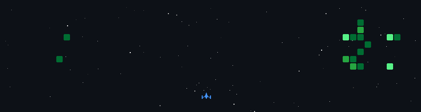

---

 

  

        
    
    
    
  

   
  

---

### Hi there 👋 I'm Gaurav Patil

## 👨‍💻 About Me :

I'm **Gaurav Patil**, a **B.Tech Computer Science & Engineering student** at  
**Walchand College of Engineering, Sangli** 🎓

I enjoy solving **algorithmic problems**, building **web applications**, and contributing to **technical communities**.  
My interests span from **competitive programming** to **full-stack development** and **computer science fundamentals**.

---

## 💻 Developer | Competitive Programmer | CS Enthusiast

- 🧠 Strong interest in **Competitive Programming (C++)**
- 🏆 Active in **CodeChef, LeetCode & contest problem solving**
- 🌐 Learning and building projects using **Web Technologies**
- 🧩 Experience as a **Problem Setter & Presenter** in coding events
- 🤝 Actively involved in **technical clubs and community events**
- 📚 Curious about **Computer Architecture, System Design & Core CS**

---

## 🛠️ Tools & Technologies

- **Frontend:** React, Next.js, Tailwind CSS, HTML, CSS, JavaScript  
- **Backend:** Node.js, Express.js, MongoDB, JWT Authentication  
- **Languages:** C++, JavaScript  
- **Version Control:** Git, GitHub  
- **Other Tools:** Docker, Vite, VS Code, Postman

---

<!-- ### 🧩 LeetCode Stats

--- -->
<!-- 
### 🏆 GitHub Stats

--- -->

## 📫 Let's Connect
I’m always open to discussions, collaborations, and learning from fellow developers.  
**LinkedIn:** [linkedin.com/in/gaurav-patil ](https://www.linkedin.com/in/gaurav-patil-1729b531a/)  
**Email:** [gaurav.patil5@walchandsangli.ac.in](mailto:gaurav.patil5@walchandsangli.ac.in)

⭐ Feel free to explore my repositories and connect!

